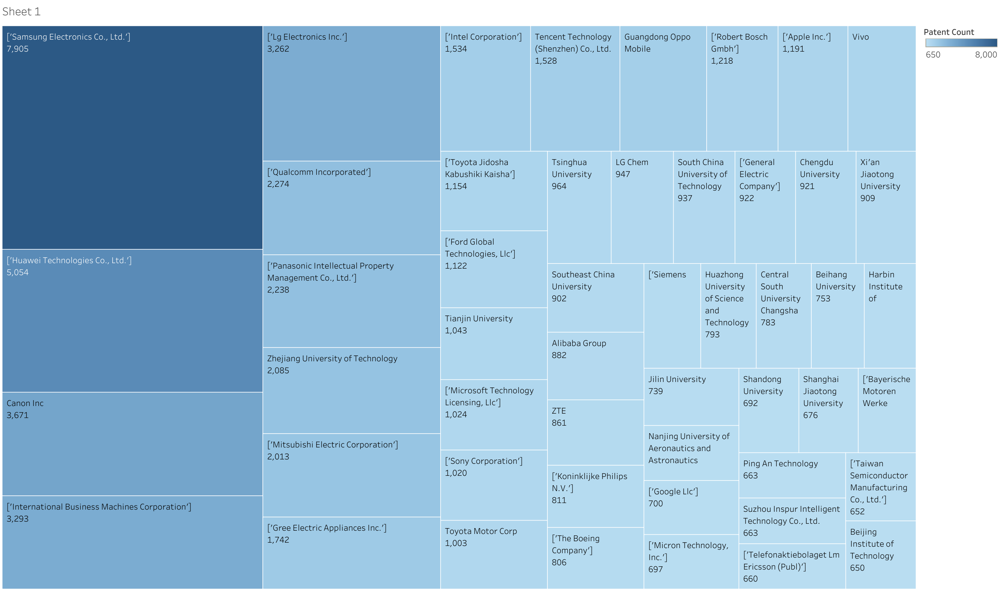

# Patent Analysis Project

- Google Patents dataset queries using Google Big Query utilising SQL through kaggle notebook 
- a sample was restricted to 1 million patent applications.
- data was restricted to one application per patent family (one datapoint for each inventive concept). 
- Data was taken from appicaitons between 2017 and 2021.
- The patent application data was cleaned, explored and analysed.
- Analysis was broken down into patents by territory, by applicant and by techology sector. 
- Visualisations were created using tableau.
- Aim of the project was to tell a story about the modern technology landscape using patent application data. 

